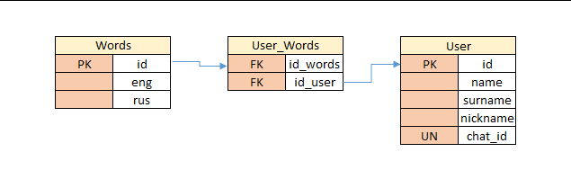

# Telegram Bot for Learning English

## Общие сведения
Этот проект представляет собой Telegram-бота, который помогает пользователям изучать английский язык, предоставляя слова для перевода и варианты ответов.

## Состав проекта

- `main.py`: основной файл работы Telegram-бота.
- `database.py`: файл создания базы данных и наполнения ее первоначальным списком слов.
- `password.ini`: файл для упрощенной работы с паролем, названием БД и токеном.
- `requirements.txt`: файл с зависимостями.
- `README.md`: файл с описанием работы.
- `diagram_BD.bmp`: файл со схемой таблиц базы данных.

## Установка и настройка

### 1. Настройка конфигурации
Откройте файл `password.ini` и заполните его следующими данными:
```ini
[password]
password = ваш_пароль
name_bd = имя_вашей_бд
token = ваш_токен_бота
```
### 2. Установка зависимостей

Убедитесь, что у вас установлены необходимые зависимости. Вы можете установить их с помощью файла `requirements.txt`:
```
pip install -r requirements.txt
```
### 3. Запуск основной программы

Запустите файл `main.py` для выполнения основной программы:
```
python main.py
```
## Работа с ботом

### Запуск бота

Запустите Telegram-бота командой `/start`. Также доступен запуск командой `/s` для сокращения.

- `/start` или `/s`: Запуск бота. Бот приветствует пользователя и предлагает перевести слово.
- `/cards`: Команда для получения карточки с новым словом для перевода.

### Взаимодействие с ботом

#### Ответ на вопрос о переводе слова:
- Бот предлагает слово на английском или русском языке и несколько вариантов перевода. Пользователь выбирает правильный ответ, нажав на соответствующую кнопку.
- Если ответ неверный, бот предлагает попробовать снова.
- После правильного ответа бот предлагает следующее слово для перевода.
#### Переход к следующему слову:
- Нажмите кнопку `ДАЛЕЕ` для перехода к следующему слову на русском языке, которое нужно перевести.
#### Добавление новой пары слов:
- Нажмите кнопку `ДОБАВИТЬ СЛОВО`, чтобы добавить новое слово (слово на английском языке и его перевод на русском языке). Введите слово через пробел.

#### Удаление пары слов:
- Нажмите кнопку `УДАЛИТЬ СЛОВО`, чтобы удалить слово. Введите слово на русском или английском языке.
- Важно: пользователь может удалить только те пары слов, которые добавил сам.

## Структура таблиц базы данных

### words
- `id` (Primary Key): Уникальный идентификатор слова.
- `eng`: Слово на английском языке.
- `rus`: Перевод слова на русском языке.

### users

- `id` (Primary Key): Уникальный идентификатор пользователя.
- `name`: Имя пользователя.
- `surname`: Фамилия пользователя.
- `nickname`: Никнейм пользователя.
- `chat_id`: Уникальный идентификатор чата пользователя.

### users_words

- `id` (Primary Key): Уникальный идентификатор записи.
- `id_user` (Foreign Key): Ссылка на пользователя из таблицы `users`.
- `id_word` (Foreign Key): Ссылка на слово из таблицы `words`.

## Схема базы данных
